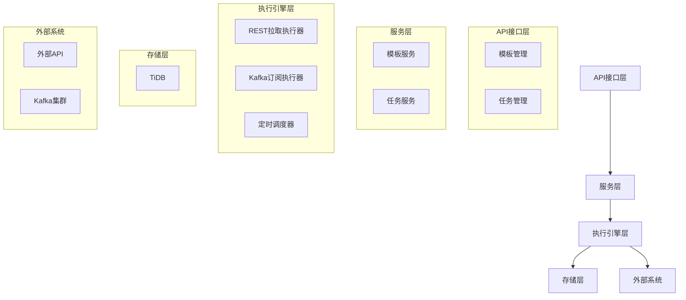
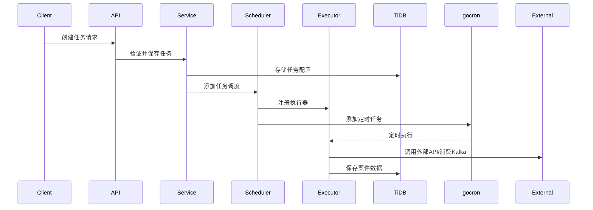
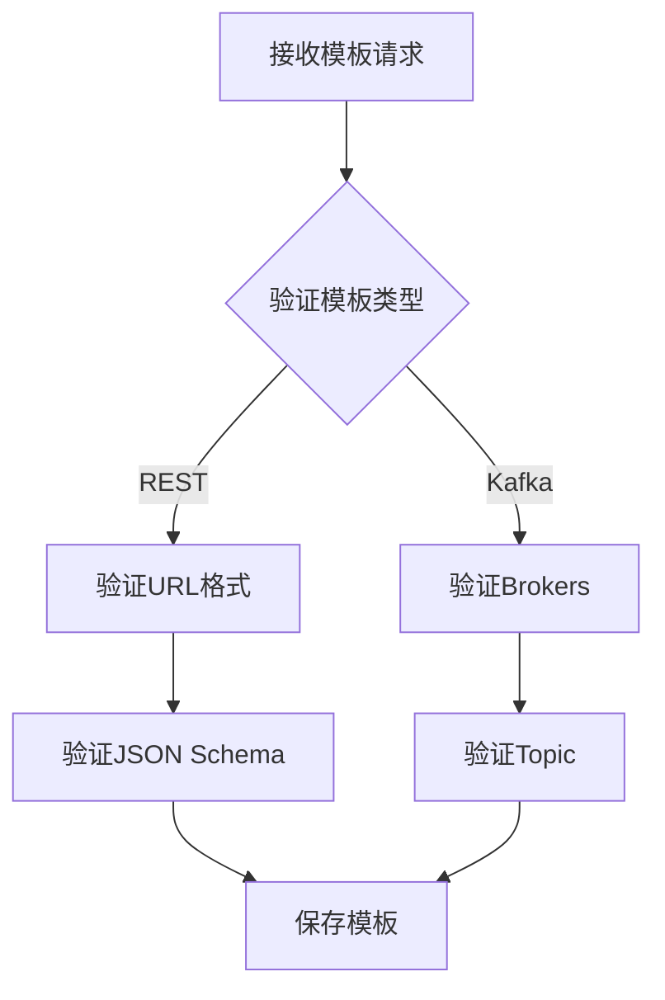
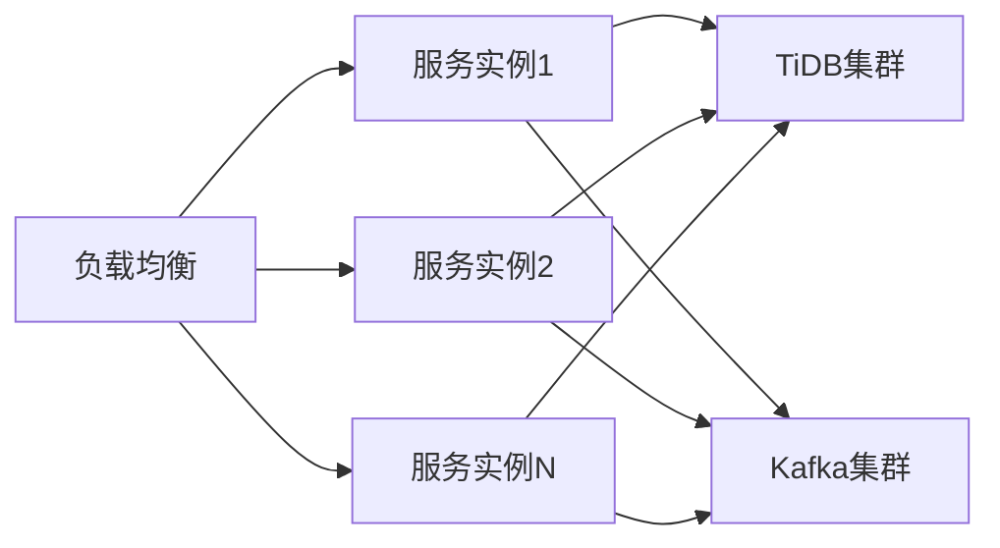

# 案件数据导入服务设计文档

## 概述
本服务提供案件数据的统一导入功能，支持多种数据接入方式（拉取、订阅推送等），通过配置模板实现不同数据源的灵活接入。

## 技术栈
- **HTTP框架**: Hertz
- **数据库**: TiDB
- **消息队列**: Kafka
- **定时任务**: gocron
- **ORM**: GORM
- **配置管理**: Viper
- **JSON Schema**: github.com/xeipuuv/gojsonschema

## 架构设计



## 数据库设计

### 1. 配置模板表 (import_template)
| 字段名          | 类型         | 描述                     |
|----------------|--------------|-------------------------|
| id             | BIGINT(20)   | 主键                    |
| name           | VARCHAR(128) | 模板名称                |
| type           | VARCHAR(32)  | 模板类型(REST/KAFKA等) |
| config         | JSON         | 模板配置                |
| created_at     | TIMESTAMP    | 创建时间                |
| updated_at     | TIMESTAMP    | 更新时间                |

### 2. 导入任务表 (import_task)
| 字段名          | 类型         | 描述                     |
|----------------|--------------|-------------------------|
| id             | BIGINT(20)   | 主键                    |
| name           | VARCHAR(128) | 任务名称                |
| case_type      | VARCHAR(64)  | 案件类型                |
| start_time     | TIMESTAMP    | 立案开始时间            |
| end_time       | TIMESTAMP    | 立案结束时间            |
| access_method  | VARCHAR(32)  | 访问方式(PULL/PUSH)    |
| template_id    | BIGINT(20)   | 模板ID                  |
| template_params| JSON         | 模板参数                |
| interval       | VARCHAR(64)  | 拉取间隔(cron表达式)    |
| status         | VARCHAR(32)  | 状态(ACTIVE/INACTIVE)  |
| last_run_time  | TIMESTAMP    | 最后执行时间            |
| created_at     | TIMESTAMP    | 创建时间                |
| updated_at     | TIMESTAMP    | 更新时间                |

## 核心模块设计

### 1. 模板管理模块
```go
type TemplateService interface {
    CreateTemplate(template *ImportTemplate) error
    GetTemplate(id int64) (*ImportTemplate, error)
    UpdateTemplate(template *ImportTemplate) error
    DeleteTemplate(id int64) error
    ListTemplates(page, size int) ([]*ImportTemplate, int64, error)
}

// 模板类型定义
const (
    TemplateTypeREST  = "REST"
    TemplateTypeKafka = "KAFKA"
)

// REST模板配置
type RESTTemplateConfig struct {
    URL         string      `json:"url"`
    Method      string      `json:"method"`
    Headers     []Header    `json:"headers"`
    RequestBody interface{} `json:"request_body"` // JSON Schema
    Response    interface{} `json:"response"`     // JSON Schema
}

// Kafka模板配置
type KafkaTemplateConfig struct {
    Brokers     []string `json:"brokers"`
    Topic       string   `json:"topic"`
    GroupID     string   `json:"group_id"`
    MessageType string   `json:"message_type"`
    Schema      string   `json:"schema"` // JSON Schema
}
```

### 2. 任务管理模块
```go
type TaskService interface {
    CreateTask(task *ImportTask) error
    GetTask(id int64) (*ImportTask, error)
    UpdateTask(task *ImportTask) error
    DeleteTask(id int64) error
    ListTasks(page, size int) ([]*ImportTask, int64, error)
    StartTask(id int64) error
    StopTask(id int64) error
}

// 访问方式定义
const (
    AccessMethodPull = "PULL"
    AccessMethodPush = "PUSH"
)
```

### 3. 执行引擎模块
```go
type Executor interface {
    Execute(task *ImportTask) error
    Stop() error
}

type ExecutorFactory interface {
    CreateExecutor(task *ImportTask) (Executor, error)
}

// REST拉取执行器
type RESTExecutor struct {
    client *http.Client
}

// Kafka订阅执行器
type KafkaExecutor struct {
    consumer sarama.Consumer
}

// 定时调度器
type TaskScheduler struct {
    scheduler *gocron.Scheduler
    tasks     map[int64]*gocron.Job
}
```

## API接口设计

### 模板管理接口 (RESTful)
```
POST   /api/v1/templates      # 创建模板
GET    /api/v1/templates/{id} # 获取模板
PUT    /api/v1/templates/{id} # 更新模板
DELETE /api/v1/templates/{id} # 删除模板
GET    /api/v1/templates      # 模板列表
```

### 任务管理接口 (RESTful)
```
POST   /api/v1/tasks          # 创建任务
GET    /api/v1/tasks/{id}     # 获取任务
PUT    /api/v1/tasks/{id}     # 更新任务
DELETE /api/v1/tasks/{id}     # 删除任务
GET    /api/v1/tasks          # 任务列表
POST   /api/v1/tasks/{id}/start # 启动任务
POST   /api/v1/tasks/{id}/stop  # 停止任务
```

## 核心流程

### 任务创建流程


### 模板验证流程


## 可扩展性设计

### 1. 执行器工厂模式
```go
type ExecutorFactoryImpl struct{}

func (f *ExecutorFactoryImpl) CreateExecutor(task *ImportTask) (Executor, error) {
    switch task.AccessMethod {
    case AccessMethodPull:
        return NewRESTExecutor(task)
    case AccessMethodPush:
        return NewKafkaExecutor(task)
    default:
        return nil, fmt.Errorf("unsupported access method: %s", task.AccessMethod)
    }
}
```

### 2. 插件式扩展
```go
// 注册新的执行器类型
func RegisterExecutorFactory(method string, factory ExecutorFactory) {
    executorFactories[method] = factory
}

// 使用示例
RegisterExecutorFactory("MQTT", &MQTTExecutorFactory{})
```

### 3. 配置模板动态加载
```go
type TemplateConfig interface {
    Validate() error
}

func UnmarshalTemplateConfig(templateType string, data []byte) (TemplateConfig, error) {
    switch templateType {
    case TemplateTypeREST:
        var config RESTTemplateConfig
        err := json.Unmarshal(data, &config)
        return &config, err
    case TemplateTypeKafka:
        var config KafkaTemplateConfig
        err := json.Unmarshal(data, &config)
        return &config, err
    default:
        return nil, fmt.Errorf("unknown template type: %s", templateType)
    }
}
```

## 错误处理设计

### 错误分类
1. **客户端错误** (400 Bad Request): 参数验证失败
2. **服务端错误** (500 Internal Server Error): 内部处理错误
3. **模板验证错误** (422 Unprocessable Entity): JSON Schema验证失败
4. **任务执行错误** (503 Service Unavailable): 外部服务不可用

### 错误响应格式
```json
{
  "code": 400,
  "message": "Invalid parameters",
  "details": {
    "field": "interval",
    "reason": "Invalid cron expression"
  }
}
```

## 性能与可靠性

1. **连接池管理**:
   - HTTP客户端使用连接池
   - Kafka消费者组管理
   
2. **任务隔离**:
   - 每个任务独立goroutine执行
   - 任务超时控制

3. **重试机制**:
   - 指数退避重试策略
   - 最大重试次数限制

4. **流量控制**:
   - 令牌桶限流
   - 任务优先级队列

## 部署方案



## 后续扩展方向

1. 支持更多数据源类型：FTP、MQTT、WebSocket等
2. 数据转换管道：添加ETL处理流程
3. 任务监控大盘：实时监控任务状态
4. 数据质量校验：添加数据验证规则
5. 分布式任务调度：支持大规模任务调度

本设计通过模块化、插件化的架构，实现了案件数据导入服务的灵活性和可扩展性，能够适应不同数据源的接入需求，同时保证了系统的稳定性和可靠性。
